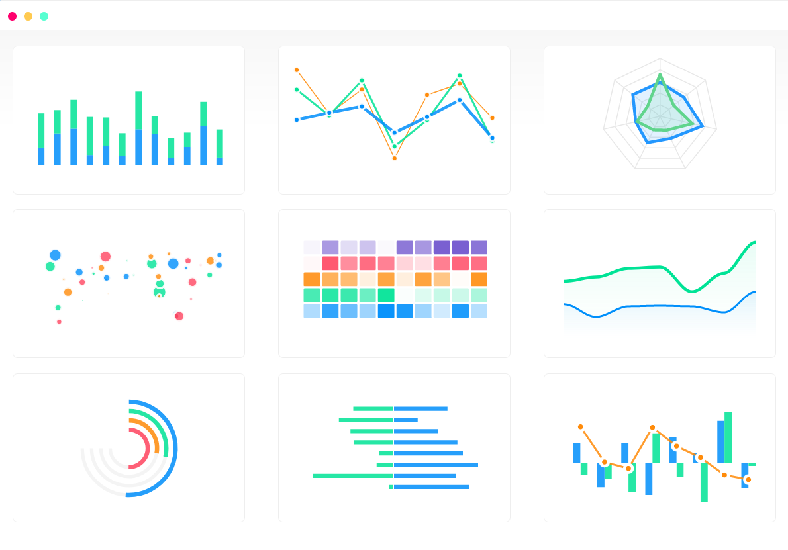
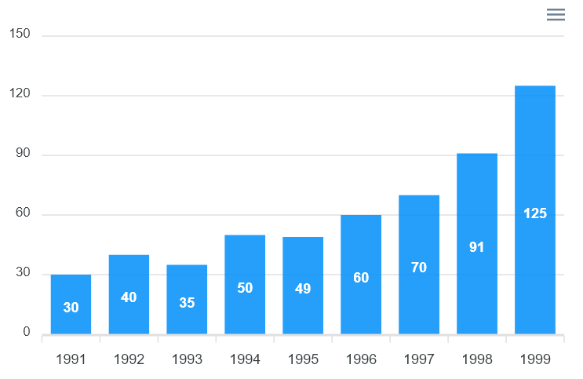
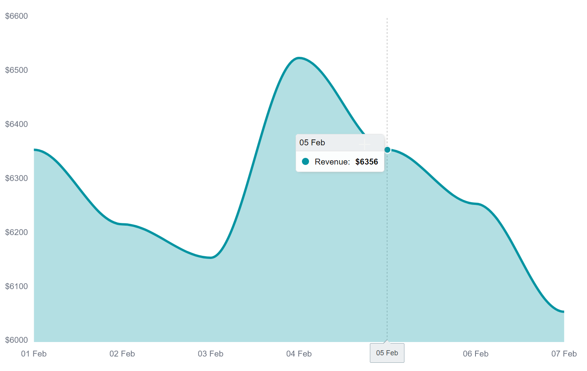

## reactpy-apexcharts



 [ReactPy](https://reactpy.dev/docs/index.html) wrapper for the [react-apexcharts](https://github.com/apexcharts/react-apexcharts) library

## Usage

    pip install reactpy-apexcharts

## Documentation

Configuration options can be found [here](https://apexcharts.com/docs/react-charts/)

### Simple Barchart Example



*./examples/chart_example.py*
```
from reactpy import component, html, run
from rectpy_apexcharts.chart import ApexChart

@component
def AppMain():

    return html.div(

        ApexChart(
            options = {
                'chart': {'id': 'apex-chart-example'},
                'xaxis': {
                'categories': [1991, 1992, 1993, 1994, 1995, 1996, 1997, 1998, 1999]}
            },

            series = [{
                'name': 'series-1',
                'data': [30, 40, 35, 50, 49, 60, 70, 91, 125]
            }],

            chart_type = "bar",
            width=500,
            height=320
        )
    )

# python -m examples.chart_example

if __name__ == "__main__":
    run(AppMain)
```

### More complex area chart

[sales.py](./sales.py), is a more complex example showing how to control color, grids and
format X & Y axis labels.



*./examples/sales_example.py*
```
from reactpy import component, html, run
from utils.logger import log, logging
from rectpy_apexcharts.chart import ApexChart

SALES_CHART = {
    "chart": {
        "fontFamily": "Inter, sans-serif",
        "foreColor": "#6B7280",
        "toolbar": {"show": False},
    },
    "fill": {
        "type": "solid",
        "opacity": 0.3,
    },
    "dataLabels": {"enabled": False},
    "tooltip": {
        "style": {
            "fontSize": "14px",
            "fontFamily": "Inter, sans-serif",
        },
    },
    "grid": {
        "show": False,
    },
    "xaxis": {
        "categories": ["01 Feb", "02 Feb", "03 Feb", "04 Feb", "05 Feb", "06 Feb", "07 Feb"],
        "labels": {
            "style": {
                "colors": ["#6B7280"],
                "fontSize": "14px",
                "fontWeight": 500,
            },
        },
        "axisBorder": {
            "color": "#F3F4F6",
        },
        "axisTicks": {
            "color": "#F3F4F6",
        },
    },
    "yaxis": {
        "labels": {
            "style": {
                "colors": ["#6B7280"],
                "fontSize": "14px",
                "fontWeight": 500,
            },
            'formatter': "${value}"
        },
    },
    "responsive": [{"breakpoint": 1024, "options": {"xaxis": {"labels": {"show": False}}}}],
}

@component
def AppMain():

    series = {"name": "Revenue", "data": [6356, 6218, 6156, 6526, 6356, 6256, 6056], "color": "#0694a2"}

    return html.div(
        ApexChart(options=SALES_CHART, series=[series], chart_type='area', height=400, width=1000)
    )

# python -m examples.sales_example

if __name__ == "__main__":
    log.setLevel(logging.INFO)
    run(AppMain)
```
